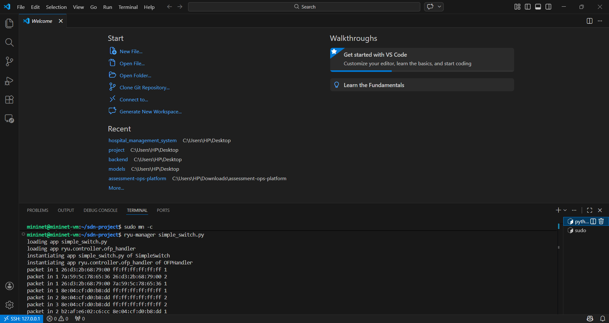
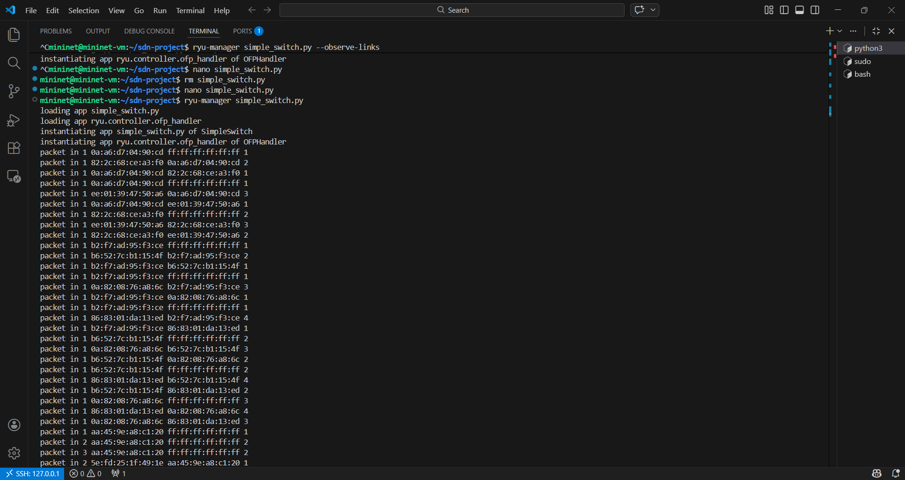
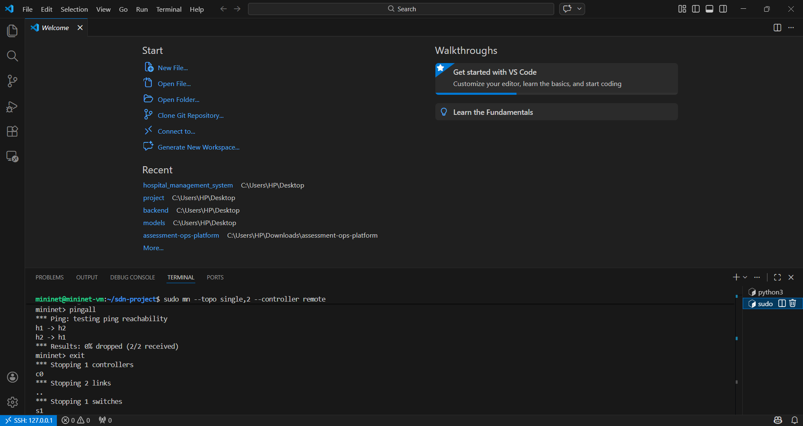
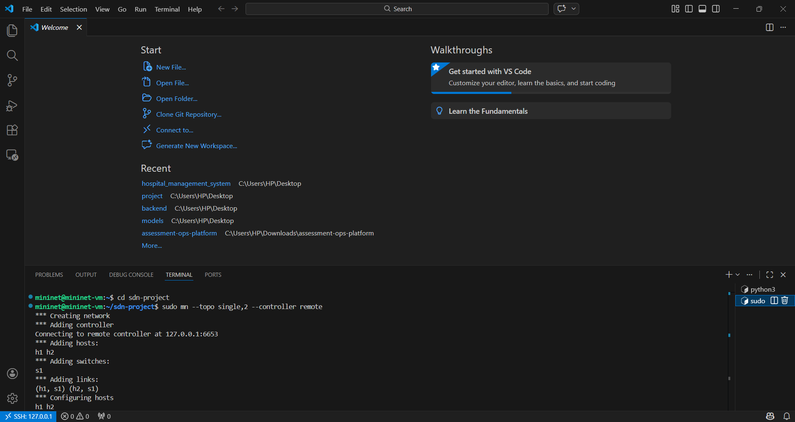

# SDN with Mininet using Ryu Controller

## 📌 Project Title
Software Defined Networking (SDN) Implementation using Mininet and Ryu Controller

---

## 🧠 Project Description
This project demonstrates Software Defined Networking (SDN) using Mininet as a network emulator and Ryu as the SDN controller.

The controller centrally manages the network using the OpenFlow protocol. Multiple network topologies were created and tested to verify connectivity and packet forwarding.

All experiments were executed inside Ubuntu Virtual Machine using VS Code terminal.

---

## 🖥️ Environment Used
- Windows (Host Machine)
- Oracle VirtualBox
- Ubuntu (Guest OS inside VM)
- VS Code (Remote connection to VM)
- Bash Terminal

---

## 🛠️ Tools and Technologies Used

### 🔹 Mininet
Used to create virtual network topology.

Commands used:
- sudo mn -c
- sudo mn --topo single,2 --controller remote
- sudo mn --topo linear,3 --controller remote
- sudo mn --topo tree,depth=2,fanout=2 --controller remote
- pingall
- exit

### 🔹 Ryu Controller
Python-based SDN controller.

Command used:
- ryu-manager simple_switch.py

Observed:
- packet-in messages
- Flow rule installation

### 🔹 OpenFlow Protocol
Used for communication between switches and controller.

### 🔹 VS Code
- Used to write simple_switch.py
- Used integrated terminal to execute commands

---

## 🌐 Network Topologies Implemented

### 1️⃣ Single Switch Topology
Command:
sudo mn --topo single,2 --controller remote

Result:
0% dropped (2/2 received)

---

### 2️⃣ Linear Topology (3 Switches)
Command:
sudo mn --topo linear,3 --controller remote

Result:
0% dropped (6/6 received)

---

### 3️⃣ Tree Topology (Depth=2, Fanout=2)
Command:
sudo mn --topo tree,depth=2,fanout=2 --controller remote

Result:
0% dropped (12/12 received)

---

## ⚙️ Execution Steps

Step 1: Clean Mininet
sudo mn -c

Step 2: Start Ryu Controller
ryu-manager simple_switch.py

Step 3: Run Topology (Example)
sudo mn --topo single,2 --controller remote

Step 4: Test Connectivity
pingall

---

## 📷 Screenshots
Screenshots of:
- Ryu controller logs
- Packet-in messages
- Single topology execution
- Linear topology execution
- Tree topology execution
- pingall results (0% packet loss)

All screenshots are included in the screenshots folder.
---

## 📷 Project Screenshots

---

## 🎯 Key Learning Outcomes
- Understanding SDN architecture (Control Plane vs Data Plane)
- Working with Mininet network emulator
- Implementing Ryu controller
- Creating and testing multiple topologies
- Analyzing packet-in logs
- Verifying connectivity using pingall

---

## 🚀 Conclusion
This project successfully demonstrates centralized network control using Software Defined Networking principles.

All implemented topologies achieved 0% packet loss, proving correct controller-switch communication and dynamic flow rule installation.
